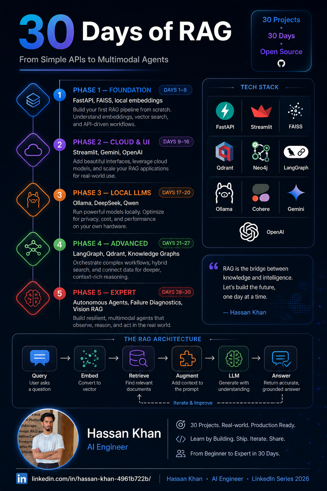

# 30 Days of RAG (Tutorial Series) — 🏆 COMPLETE 🏆

**Author:** Hassan Khan  
**Email:** `hassanaiengineer@gmail.com`  
**LinkedIn:** [Hassan Khan on LinkedIn](https://www.linkedin.com/in/hassan-khan-4961b722b/)  
**Series Status:** Complete (30/30 Days Shipped) 🎉

This repository is a **comprehensive, hands-on 30-day RAG series**. It contains 30 independent, self-contained projects (FastAPI APIs + Streamlit dashboards) covering retrieval patterns, agentic routing, hybrid search, knowledge graphs, local LLM deployment, multimodal (vision) RAG, and production diagnostics.

Motivation and goals: see `MOTIVATION.md`.



## 🔑 Key Architecture & Patterns Covered

Across these 30 days, we built and explored several production-level architectures:
1. **API foundations (Days 01–08):** Building minimal RAG, multi-query expansion, tool augmented loops, corrective RAG, and GraphRAG using FastAPI.
2. **Interactive Frontends (Days 09–16):** Developing Streamlit-based PDF and webpage chat dashboards, integrating Google Gemini, OpenAI, LanceDB, and Cohere.
3. **Privacy-First Local RAG (Days 17–20):** Running local embedding and reasoning LLMs (DeepSeek, Qwen, Gemma) using Ollama, SymPy, and Qdrant.
4. **Advanced Orchestration (Days 21–27):** Dynamic multi-tenant collection routing, multilingual search, Neo4j knowledge graphs, and complex state machines with LangGraph.
5. **Expert Systems & Vision (Days 28–30):** Autonomous research loops, diagnostic CLI testing for the 12 RAG failure modes, and multimodal document vision engines.

## Tech Stack (Across the Series)

Not every tutorial uses every tool, but you’ll see many of these across days:

- FastAPI: https://fastapi.tiangolo.com/
- Uvicorn: https://www.uvicorn.org/
- Streamlit: https://streamlit.io/
- Sentence Transformers: https://www.sbert.net/
- FAISS: https://github.com/facebookresearch/faiss
- Qdrant: https://qdrant.tech/
- Neo4j: https://neo4j.com/
- Ollama (local LLMs): https://ollama.com/

## Quick Start / How to Run

Each numbered folder is an independent, self-contained project. 

### For API Tutorials (Days 01–08)
These are built with FastAPI. To run them:

```bash
cd 01_simple_rag_api
pip install -r requirements.txt
python -m app.ingest
uvicorn api.main:app --reload
```

### For UI Tutorials (Days 09–30)
These are built with Streamlit. To run them:

```bash
cd 10_hybrid_search_rag_raglite
pip install -r requirements.txt
streamlit run main.py
```

> **Note:** Some tutorials require API keys (OpenAI, Gemini, etc.) or external services (Qdrant, Neo4j). Use the `.env.example` file in the root directory as a starting point. If your system defaults to Python 2, make sure to use `python3` and `pip3`.

## Tutorials

### 🟦 Phase 1: Foundation (Days 01–08)
*Focus: Core RAG patterns using FastAPI, local embeddings, and offline logic.*

| Day | Folder | Type | Topic | Key Tech |
|---:|---|---|---|---|
| 01 | `01_simple_rag_api/` | FastAPI | Minimal RAG API | FAISS + SentenceTransformers |
| 02 | `02_multiquery_rag_api/` | FastAPI | Multi-query expansion | Offline Recall Optimization |
| 03 | `03_self_rag_api/` | FastAPI | Self-RAG loop | Iterative Refinement |
| 04 | `04_tool_augmented_rag_api/` | FastAPI | Tool-augmented RAG | Agentic Tool Scaffolding |
| 05 | `05_corrective_rag_api/` | FastAPI | Corrective flow (CRAG) | Retrieve → Evaluate → Refine |
| 06 | `06_hybrid_rag_api/` | FastAPI | Hybrid retrieval | Semantic + BM25 Fusion |
| 07 | `07_graph_rag_api/` | FastAPI | Graph-style expansion | NetworkX Knowledge Paths |
| 08 | `08_agentic_rag_api/` | FastAPI | Agentic orchestration | Autonomous API Logic |

---

### 🟪 Phase 2: Cloud & UI (Days 09–16)
*Focus: Streamlit dashboards, PDF chat, and integrating major LLM providers (Google, OpenAI).*

| Day | Folder | Type | Topic | Key Tech |
|---:|---|---|---|---|
| 09 | `09_rag_chain_pdf_chat/` | Streamlit | PDF Document Chat | Gemini + ChromaDB |
| 10 | `10_hybrid_search_rag_raglite/` | Streamlit | Hybrid search + Reranking | RAGLite + Cohere |
| 11 | `11_local_hybrid_search_rag_raglite/` | Streamlit | Local hybrid with GGUF | Llama-cpp + UI |
| 12 | `12_local_rag_agent_agno_ollama/` | Python | Local RAG agent | Qdrant + Agno |
| 13 | `13_llama_webpage_rag/` | Streamlit | Webpage chat | Ollama + Chroma |
| 14 | `14_agentic_rag_gpt5_agno/` | Streamlit | URL Context Indexing | LanceDB + OpenAI |
| 15 | `15_agentic_rag_embedding_gemma/` | Streamlit | Local retrieval agent | EmbeddingGemma + LanceDB |
| 16 | `16_agentic_rag_with_reasoning/` | Streamlit | Reasoning-based RAG | OpenAI + Gemini |

---

### 🟧 Phase 3: Local LLMs (Days 17–20)
*Focus: Running cutting-edge local models (DeepSeek, Qwen) for specific RAG tasks.*

| Day | Folder | Type | Topic | Key Tech |
|---:|---|---|---|---|
| 17 | `17_agentic_rag_math_agent/` | Streamlit | Math & Logic Agent | SymPy + Ollama |
| 18 | `18_gemini_agentic_rag/` | Streamlit | Production Qdrant RAG | Gemini + Qdrant Cloud |
| 19 | `19_deepseek_local_rag_agent/` | Streamlit | DeepSeek reasoning | Ollama + Qdrant |
| 20 | `20_qwen_local_rag_agent/` | Streamlit | Model-routing UI | Qwen/Gemma Selection |

---

### 🟩 Phase 4: Advanced & Agentic (Days 21–27)
*Focus: Managed RAG services, Knowledge Graphs, and complex orchestration with LangGraph.*

| Day | Folder | Type | Topic | Key Tech |
|---:|---|---|---|---|
| 21 | `21_rag_as_a_service_ragie/` | Streamlit | RAG-as-a-Service | Ragie + Anthropic |
| 22 | `22_rag_agent_cohere_qdrant/` | Streamlit | Multilingual RAG | Cohere + Qdrant |
| 23 | `23_rag_database_routing/` | Streamlit | Dynamic Collection Routing | Multi-tenant Qdrant |
| 24 | `24_knowledge_graph_rag_citations/` | Streamlit | Knowledge Graph Citations | Neo4j + Ollama |
| 25 | `25_contextualai_rag_agent/` | Streamlit | Managed Datastores | ContextualAI |
| 26 | `26_ai_blog_search_langgraph/` | Streamlit | Agentic LangGraph flow | Gemini + Qdrant |
| 27 | `27_corrective_rag_langchain/` | Streamlit | CRAG with Web Search | Tavily + LangChain |

---

### 🟥 Phase 5: Expert & Multimodal (Days 28–30)
*Focus: Autonomous research agents, multimodal (Vision) RAG, and production diagnostics.*

| Day | Folder | Type | Topic | Key Tech |
|---:|---|---|---|---|
| 28 | `28_autonomous_rag_agent/` | Streamlit | Autonomous Researcher | PDF + Web Autonomy |
| 29 | `29_rag_failure_diagnostics_clinic/` | CLI | RAG Fatigue Diagnostics | P01–P12 Failure Modes |
| 30 | `30_vision_rag_multimodal/` | Streamlit | Multimodal Vision RAG | Cohere Vision + Gemini |

## Environment

See `.env.example` for common environment variables used across tutorials.

## Contributing

See `CONTRIBUTING.md`.

## License

MIT — see `LICENSE`.
